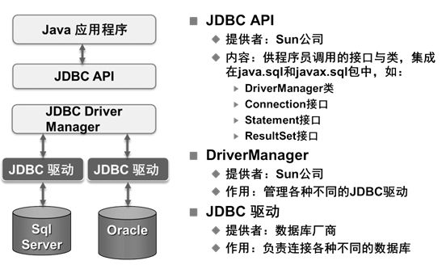

#  <center> <font color='1ba784'> mybatis 项目概述与总览</font>

##  <font color='#93d5dc'>**写在开始之前**</font>
作为一个 java 从业者，mybatis 是一个绕不去的话题，虽然后端还有 hibernate 和 spring data jpa 等一系列的 orm 框架，但是 mybatis 还是以他的易用性赢得了更多用户的青睐，快进入而立之年，在搬砖之余，希望学习底层的技术来加强自己的技术，这个系列的文章可能会非常枯燥，也可能因为自己各方面能力有限而显得漏洞百出，但那又如何，我就是我！

## Mybatis、JDBC 的
mybatis 是一套半自动化数据持久化框架，他帮我们更好的将数据持久化到数据库中。他是对 JDBC 的封装，我们首先 来回顾一下 JDBC 时我们是怎么讲数据持久化的：</br>
</br>
我们再来回顾一下几个重要的类：</br>
* **DriverManger** : 这个类管理数据库驱动程序的列表。确定内容是否符合从Java应用程序使用的通信子协议正确的数据库驱动程序的连接请求。识别JDBC在一定子协议的第一个驱动器将被用来建立数据库连接。
* **Driver**: 此接口处理与数据库服务器通信。很少直接直接使用驱动程序（Driver）对象，一般使用DriverManager中的对象，它用于管理此类型的对象。它也抽象与驱动程序对象工作相关的详细信息。
* **Connection** : 此接口与接触数据库的所有方法。连接对象表示通信上下文，即，与数据库中的所有的通信是通过此唯一的连接对象。 
* **Statement** : 可以使用这个接口创建的对象的SQL语句提交到数据库。一些派生的接口接受除执行存储过程的参数。
* **ResultSet**: 这些对象保存从数据库后，执行使用Statement对象的SQL查询中检索数据。它作为一个迭代器，可以通过移动它来检索下一个数据。
</br>

我们用一小片段的代码来回顾一下:
</br>
1. 先写一个获取连接的工具类
```java
public class DbUtil {
    //或者创建一个 properties 文件 将数据连接信息保存到该文件中 然后用Propertis读取
    public static final String URL = "jdbc:mysql://localhost:3306/imooc";
    public static final String USER = "root";
    public static final String PASSWORD = "123456";
    private static Connection conn = null;
    static{
        try {
            //1.加载驱动程序
            Class.forName("com.mysql.jdbc.Driver");
            //2. 获得数据库连接
            conn = DriverManager.getConnection(URL, USER, PASSWORD);
        } catch (ClassNotFoundException e) {
            e.printStackTrace();
        } catch (SQLException e) {
            e.printStackTrace();
        }
        
    }

    public static Connection getConnection(){
        return conn;
    }
}

```
2. 实体类
```java
 @Data
 public class User {
     private Integer id ;
     private String name;
 }
```
3. 测试类
```java
    public class UserMapper {
        public static void main(Stirng[] args){
            Connection conn = null;
            PreparedStatement st = null;
            ResultSet rs = null;
            try{
                 //获取连接
                conn = DbUtil.getConnection();
                String query = "INSERT INTO user (id,name) values(1,'xiaolei')";
                st = conn.prepareStatement(sql);
                st.execute();
                conn.commit()
            }catch(Exception e){
                e.printStackTrace();
                conn.rollBack();
            }finally{
                conn.close();
            }
            
        }
    
    }
```
好了回顾了一遍 JDBC 我们再联系 Mybatis ，我们来发散一下： 既然mybatis是对 JDBC 的扩展，那么Mybatis 是不是也要帮我们获取连接Connection，然后帮我们拿到  sql 执行器 Statement ，每次  sql 执行完毕，还要帮我们关闭资源。 Mybatis 功能很强大，当然不单单只帮我们干了这点事，我们先就JDBC的方式带着上面的思考来去看我们的源码，一步一步解开Mybatis的神秘面纱。
## Mybtais 架构
首先我们去 github 上 `frok` 一下 Mybatis，然后c lone 到本地，这样方便我们调试，也方便我们注释。下图是mybatis的架构：</br>
</br>
我们再去看看源码的包目录结构：</br>
</br>
在项目中，我们常常要写 mybatis-config.xml 文件，如下：</br>
</br>
我们来对配置文件进行简单的剖析，mybatis 能够读取到 xml 文件中的数据库信息，那么首先是不是要有个 IO 流去读取到配置信息 ，然后配置写在xml文件中的话，是不是要对 xml的标签进行解析，我们知道每个标签都是个类，那么我们可以带着这些思考去调试源码，那么最好的方式就是参照官方文档。今天我们只是通过 JDBC 的可持续化方案，来引申到mybatis ,任何技术你知道他的底层，他的技术思想那么你去学新技术那就会事半功倍。好了不罗嗦，mybatis怎么加载配置信息，这些都不是重点，重点的是学习先进的思想。下期见！